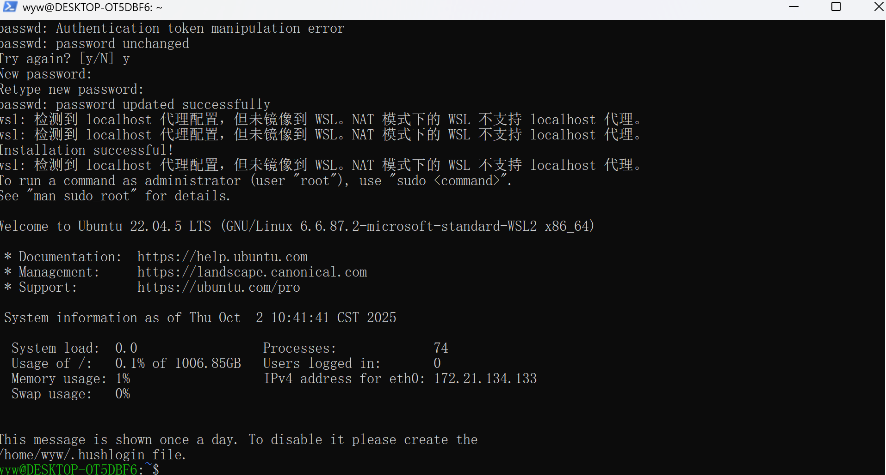
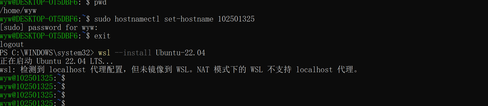
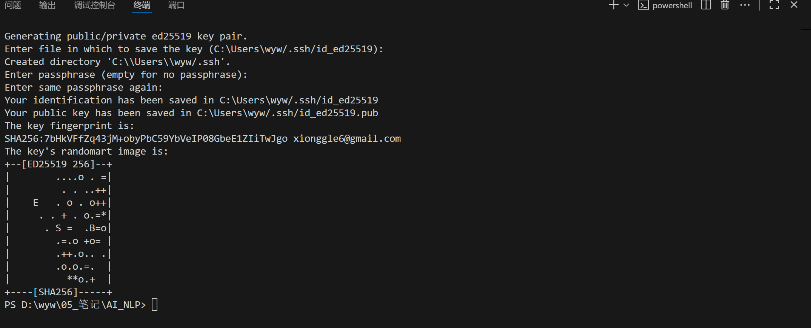
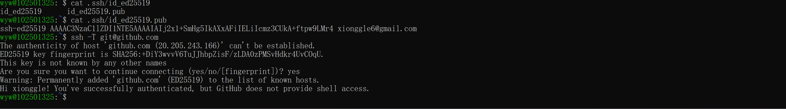
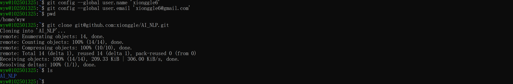
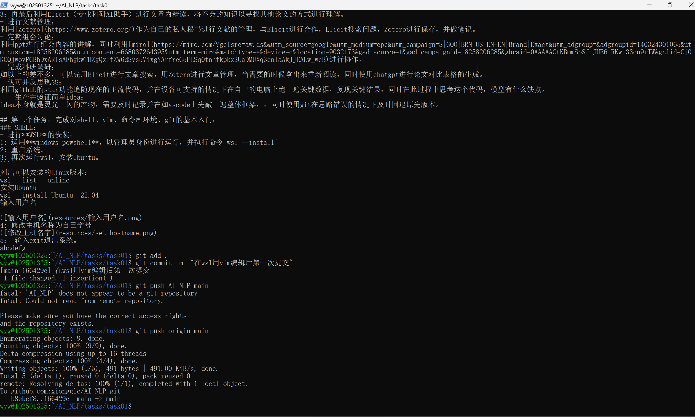
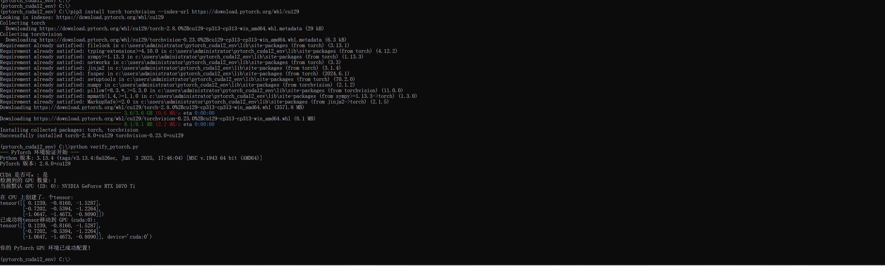

# AI-NLP二轮面试
----
## 第一个任务：关于AI知识学习方法与工具以及对Transformer架构的思考
### 对Transformer架构的思考:
- **Transformer**的最主要优势：
 相比于[RNN](循环神经网络)以及[LSTM](增强版的RNN)以时间序列处理数据，Transformer具有的自注意机制可以并行处理序列，防止因为序列过长导致一开始的数据被遗忘，同时可以提高训练速度（通过巨大的矩阵乘法来训练）（如果没有Transformer，用LSTM训练chatgpt3 4甚至现在的5所需要的时间成本是不可估量的）。
 - **Transformer**面临的最主要问题：
依我之见，最大的问题莫过于当今AI架构所必然导致的幻觉问题了。当我们问了一个AI不会或者模糊的问题，AI的第一反应不是说我不会（空白的回应在训练中是不被鼓励的），而是通过[AI回应的方法](通过大数据预测下一个最可能出现的词)（概率检测）去编造一个并不存在的“事实”，因此缺乏可靠性，我们如今也无法100%相信AI说的答案。
### 在AI学习中所可以用到的方法以及工具：
- 追随业界热点：
热点往往以天来计算，我们可以在刷牙洗脸的时候用b站来听最新的ai资讯，当听到自己好奇的内容时，及时使用[arVix](https://arxiv.org/)进行文献搜索并进行文献阅读。
- 文献阅读：
1：先利用Deepseek，chatgpt等AI进行科研文章总结，了解是否与自己主攻方向相关，并提取精华部分。
2：用ppt精读全文，理解其中的主线，但是对于自己不会的知识暂时搁置。
3：再最后利用Elicit（专业科研AI助手）进行文章内精读，将不会的知识以寻找其他论文的方式进行理解。
- 进行文献管理：
利用[Zotero](https://www.zotero.org/)作为自己的私人秘书进行文献的管理，与Elicit进行合作，Elicit搜索问题，Zotero进行保存，并做笔记。
- 定期组会讨论：
利用ppt进行组会内容的讲解，同时利用[miro](https://miro.com/?gclsrc=aw.ds&&utm_source=google&utm_medium=cpc&utm_campaign=S|GOO|BRN|US|EN-EN|Brand|Exact&utm_adgroup=&adgroupid=140324301065&utm_custom=18258206285&utm_content=668037264395&utm_term=miro&matchtype=e&device=c&location=9032173&gad_source=1&gad_campaignid=18258206285&gbraid=0AAAAACtKBmmSpSf_JUE6_RKw-33cu9rIW&gclid=Cj0KCQjwovPGBhDxARIsAFhgkwTHZgQxIfZW6dSvs5VixgYArfreG5FLSq0tnhfkpkx3UaDMUXq3enIaAkJJEALw_wcB)进行协作。
- 完成科研调研：
如以上的差不多，可以先用Elicit进行文章搜索，用Zotero进行文章管理，当需要的时候拿出来重新阅读，同时使用chatgpt进行论文对比表格的生成。
- 认可并反思现实：
利用github的star功能追随现在的主流代码，并在设备可支持的情况下在自己的电脑上跑一遍关键数据，复现关键结果，同时在此过程中思考这个代码，模型有什么缺点。
-   生产并验证简单idea：
idea本身就是灵光一闪的产物，需要及时记录并在如vscode上先敲一遍整体框架，，同时使用git在思路错误的情况下及时回退原先版本。
----
## 第二个任务：完成对shell、vim、命令⾏环境、git的基本入门：
### SHELL：
- 进行**WSL**的安装：
1: 运用**windows powshell**，以管理员身份进行运行，并执行命令`wsl --install`
2: 重启系统。
3: 再次运行wsl，安装Ubuntu。
```
列出可以安装的Linux版本：
wsl --list --online
安装Ubuntu
wsl --install Ubuntu--22.04
输入用户名
```

4: 修改主机名称为自己学号

5：输入exit退出系统。
### 在VSCode以及WSL上面设置git以及github：
- VSCode上的github设置：
1：首先在VSCode上下载git，以将工作区的内容commit -a到本地仓库。
2：利用ssd，在github上面设置公钥，然后在终端上面git config，再git push将本地仓库的内容上传到github。
- WSL上面的github设置：
1：输入cd进入主目录，在WSL上设置密钥。

2： 查看公钥，并且上传到github，并测试。

3:在WSL上面输入邮箱和用户名。

4： 利用clone来克隆github上面的项目，同时初始化本地仓库，储存clone的内容。
5：利用vim修改markdown，然后再用add . commit-m push到github

- 其中的代码使用有：
```
1:cd pwd ls
2:ssh-keygen
3:cat
4:git config
5:git clone
6: git init
7:git add . git commit -m git push origin main
```
**[github的链接](https://github.com/xionggle/AI_NLP/)**
---
---
## 第三个任务：AI的环境配置：
==以下内容，全部用自己家的台式机进行配置，只能在家使用，笔记本则会用autodl进行租聘。==
- 环境配置报告：
- GPU型号：NVIDIA GeForce RTX 5070Ti
- 驱动版本：581.42
- CUDA Toolkit 的具体版本号：12.9
- pytorch版本号：2.8.0+cu129
- 挑战：一开始担心cuda版本太高不适配就下了12.6的版本，然后在运行验证脚本的时候发现出错了，查了chatgpt发现可能版本号太低pytorch无法兼容。于是把12.6版本删了重新下载12.9的版本，然后配置成功。还有一个问题就是复制粘贴验证脚本的时候发现缩进没有复制过去，于是自己在vscode上面调整了一下缩进。

